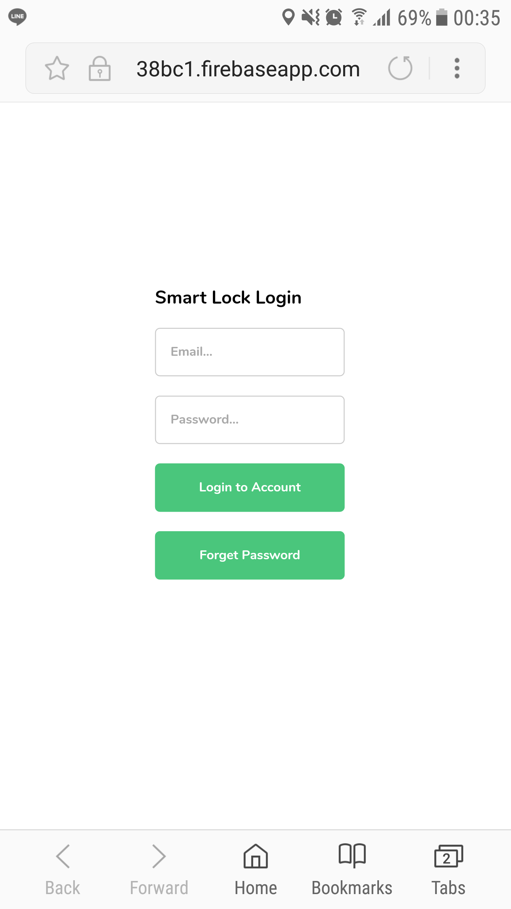
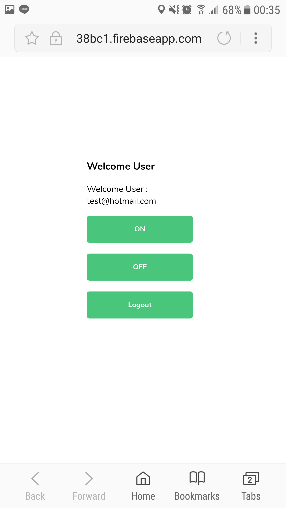

3# Smart-Lock
  เคยหงุดหงิดกับการหากุญแจบ้านไม่เจอ ลืมกุญแจไว้ในห้อง หรือทำกุญแจหายไหมครับ? เราคือกลุ่ม Smart-Lock ที่ประสบปัญหานี้บ่อยครั้งจึงได้คิด Smart-Lock ขึ้นมาเพื่อขจัดปัญหาเหล่านี้ให้หมดไป
# How it works?
  หลักการทำงานของเจ้า Smart-Lock ตัวนี้คือการใช้ Email และ Password แทนกุญแจเพื่อ Login เข้าระบบที่ใช้ในการล็อหรือปลดล็อคประตูจากที่ไหนก็ได้บนโลกนี้

  
  

# What we used?
ภาษา
* C++
* HTML
* JavaScript
* CSS
* Firebase

อุปกรณ์
* Nodemcu V3.0
* Protoboard
* Wire
* Relay 5V Module
* Active Buzzer Module
* LED
* Electric lock 12V
* Adapter

ไลบลารี่
* ESP8266WiFi.h
* FirebaseArduino.h

# Members

|  |  |  |
| :-: | :-: | :-: |
|นางสาวผกายมาศ ตั้งตรงใจสกุล|นายพสิษฐ์ พรมราช|นายพิพัฒน์บุญ พุทธคุณ|
|60070054 |      60070060      |      60070065      |

# Instructor

|  |  |
| :-: | :-: |
|ผศ. ดร. กิติ์สุชาต พสุภา|ผศ. ดร. ปานวิทย์ ธุวะนุติ|
